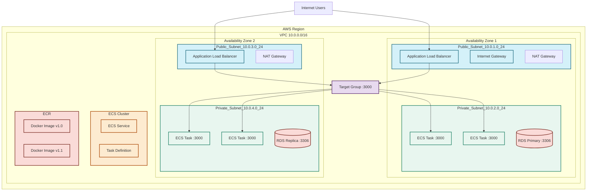

# **AWS VPC, ECS, & Load Balancer Architecture Guide**  
*Understanding Network Isolation, Container Orchestration, and Traffic Management*

---

## **1. VPC (Virtual Private Cloud) Fundamentals**

### **What is a VPC?**
A **Virtual Private Cloud (VPC)** is a logically isolated virtual network within AWS where you can launch AWS resources. Think of it as your **private data center within AWS**.

### **Key Characteristics:**
- **Isolation**: Each VPC is completely separate from other VPCs
- **Customizable**: You define your own IP address range, subnets, and routing
- **Region-specific**: VPCs exist within a specific AWS region
- **Default VPC**: AWS creates one for you in each region (but production uses custom VPCs)

---

## **2. Subnets: Public vs Private**

### **What are Subnets?**
Subnets are subdivisions of your VPC's IP address range, each located in a specific **Availability Zone (AZ)** for high availability.

### **Public Subnet**
- **Purpose**: Hosts resources that need direct internet access
- **Key Feature**: Has a route to an **Internet Gateway (IGW)**
- **Typical Use**: Web servers, load balancers, bastion hosts
- **Traffic Flow**: Can send/receive traffic to/from the internet

### **Private Subnet**
- **Purpose**: Hosts resources that should NOT be directly accessible from the internet
- **Key Feature**: NO direct route to internet; uses **NAT Gateway** for outbound traffic
- **Typical Use**: Databases, application servers, internal services
- **Traffic Flow**: Can only communicate within VPC or via NAT Gateway

### **Architecture Pattern:**
```
VPC (10.0.0.0/16)
├── Public Subnet (10.0.1.0/24) - AZ1
│   └── Web Server/ALB
├── Private Subnet (10.0.2.0/24) - AZ1
│   └── Database
├── Public Subnet (10.0.3.0/24) - AZ2
│   └── Web Server/ALB
└── Private Subnet (10.0.4.0/24) - AZ2
    └── Database (Replica)
```

### **Why Separate Public & Private?**
1. **Security**: Database has no public IP → cannot be hacked directly
2. **Compliance**: Meets security standards requiring backend isolation
3. **Cost Control**: Reduces attack surface, minimizing breach risks
4. **Network Hygiene**: Clear separation of concerns

---

## **3. ECR (Elastic Container Registry)**

### **What is ECR?**
ECR is AWS's **managed Docker container registry** for storing, managing, and deploying Docker container images.

### **Key Features:**
- **Private Registry**: Your images are not publicly accessible
- **Integrated Security**: Uses IAM for access control
- **Automatic Scanning**: For vulnerabilities
- **Lifecycle Policies**: Automatically clean up old images

### **Basic Workflow:**
1. Build Docker image locally
2. Authenticate Docker to ECR
3. Tag image with ECR repository URI
4. Push image to ECR
5. ECS pulls from ECR when deploying

---

## **4. ECS (Elastic Container Service)**

### **What is ECS?**
ECS is AWS's fully managed **container orchestration service** that runs Docker containers.

### **ECS Launch Types:**
1. **EC2 Launch Type**: You manage EC2 instances (more control, more management)
2. **Fargate Launch Type**: Serverless (AWS manages infrastructure)

### **ECS Core Components:**

#### **A. Task Definition (Blueprint)**
- **Purpose**: JSON file that describes how to run a Docker container
- **Contains**: Image, CPU/memory, networking, environment variables, volumes
- **Example**:
```json
{
  "family": "web-app",
  "containerDefinitions": [
    {
      "name": "web",
      "image": "123456789012.dkr.ecr.region.amazonaws.com/web-app:latest",
      "cpu": 256,
      "memory": 512,
      "portMappings": [
        {
          "containerPort": 3000,
          "protocol": "tcp"
        }
      ]
    }
  ]
}
```

#### **B. Task (Running Container)**
- **What**: A running instance of a Task Definition
- **Note**: Ephemeral - if it stops, a new one might start

#### **C. Service (Manager)**
- **Purpose**: Maintains a specified number of Tasks running simultaneously
- **Features**:
  - Auto-scaling (scale up/down based on load)
  - Load balancing integration
  - Health checks and recovery
  - Rolling deployments

#### **D. Cluster**
- **What**: Logical grouping of Tasks/Services
- **Contains**: EC2 instances (EC2 launch type) or nothing (Fargate)

### **ECS Workflow:**
1. Create Task Definition
2. Create Service that references Task Definition
3. Service launches Tasks on Cluster
4. Service monitors and maintains desired Task count

---

## **5. ALB (Application Load Balancer)**

### **The Problem: Direct VPC Server Access**
Even with a public subnet and public IP, you **shouldn't** directly expose your application servers because:
1. **No redundancy**: Single point of failure
2. **No health checks**: Unhealthy instances still receive traffic
3. **No SSL termination**: Each server handles SSL overhead
4. **No path-based routing**: All traffic goes to all servers

### **The Solution: ALB**
An **Application Load Balancer (ALB)** distributes incoming application traffic across multiple targets.

### **ALB Components:**

#### **1. ALB Itself**
- **Placement**: Always in **public subnets** (needs internet access)
- **Features**: 
  - HTTP/HTTPS traffic (Layer 7)
  - SSL termination
  - Path-based routing
  - Host-based routing
  - WebSocket support

#### **2. Target Group (TG)**
- **Purpose**: Group of targets (ECS tasks, EC2 instances, Lambda functions)
- **Configuration**: 
  - Port/protocol
  - Health check settings
  - Stickiness (session affinity)

#### **3. Listeners**
- **What**: Checks for connection requests
- **Rules**: Forward to Target Groups based on conditions (path, host header)

#### **4. Security Groups**
- **ALB Security Group**: Allows inbound HTTP/HTTPS from internet
- **ECS/EC2 Security Group**: Allows inbound traffic **only from ALB Security Group**

### **Traffic Flow:**
```
Internet User
    ↓ (HTTPS:443)
Application Load Balancer (Public Subnets)
    ↓ (HTTP:3000) [ALB Security Group → ECS Security Group]
Target Group
    ↓
ECS Tasks (Private Subnets)
```

---

## **6. Security Groups: The Traffic Police**

### **What are Security Groups?**
Virtual firewalls that control inbound and outbound traffic at the **instance/container level**.

### **Key Concepts:**
- **Stateful**: Allow rules automatically allow return traffic
- **Instance-level**: Applied to individual resources
- **No DENY rules**: Only ALLOW rules (default deny everything)

### **Typical Security Group Setup:**

#### **ALB Security Group:**
```yaml
Inbound Rules:
  - HTTP (80) from 0.0.0.0/0
  - HTTPS (443) from 0.0.0.0/0
  
Outbound Rules:
  - All traffic to ECS Security Group on port 3000
```

#### **ECS/EC2 Security Group:**
```yaml
Inbound Rules:
  - TCP 3000 from ALB Security Group
  
Outbound Rules:
  - All traffic to anywhere
```

#### **Database Security Group:**
```yaml
Inbound Rules:
  - TCP 3306 (MySQL) from ECS Security Group
  
Outbound Rules:
  - All traffic to anywhere
```

---

## **7. Complete Architecture Diagram**



---

## **8. Deployment Checklist**

### **Phase 1: Network Setup**
- [ ] Create VPC with appropriate CIDR
- [ ] Create public and private subnets across 2+ AZs
- [ ] Create Internet Gateway and attach to VPC
- [ ] Create NAT Gateways in public subnets
- [ ] Configure route tables for public/private subnets
- [ ] Create necessary security groups

### **Phase 2: Container Registry**
- [ ] Create ECR repository
- [ ] Build and push Docker image to ECR

### **Phase 3: ECS Setup**
- [ ] Create ECS Cluster
- [ ] Create Task Definition
- [ ] Create ECS Service
- [ ] Configure auto-scaling policies

### **Phase 4: Load Balancing**
- [ ] Create Application Load Balancer
- [ ] Create Target Group
- [ ] Configure listener rules
- [ ] Register ECS tasks with Target Group

### **Phase 5: Database**
- [ ] Create RDS instance in private subnets
- [ ] Configure security groups (only ECS access)
- [ ] Set up read replicas (if needed)

---

## **9. Key Takeaways**

1. **VPC is your network foundation** - Design it carefully with proper subnetting
2. **Public vs Private Subnets** - Always keep databases in private subnets
3. **ECR stores, ECS runs** - ECR is your container warehouse, ECS is your container factory
4. **Task Definition = Blueprint** - Defines how to run your container
5. **Service = Manager** - Keeps your application running and scalable
6. **ALB = Traffic Director** - Never expose servers directly; always use ALB
7. **Security Groups = Firewall** - Control access at the instance level
8. **Multi-AZ = High Availability** - Spread resources across Availability Zones

---

**Architecture Principle**: This setup follows AWS Well-Architected Framework principles - secure, high-performing, resilient, and efficient. Each component has a specific role, and security is implemented in layers (VPC isolation + security groups).