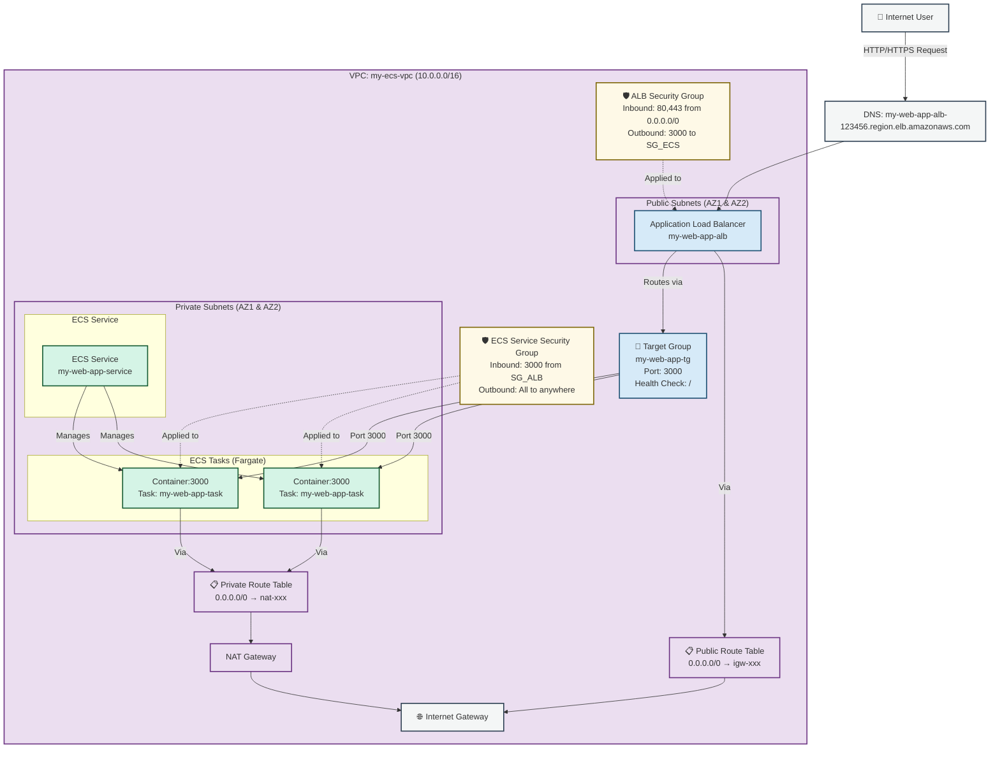

# 🚀 Deploy ECR Image to ECS Using VPC, ALB, Target Group & Security Groups

## What you will achieve

You will:

1. Create a **custom VPC** (public + private)
2. Run your ECR image as an **ECS Task**
3. Deploy it via **ECS Service**
4. Expose it using **Application Load Balancer**
5. Fix access using **Security Groups**
6. Access your app via **Load Balancer DNS**

---

## 1️⃣ Create VPC (Network Foundation)

### Go to:

```
AWS Console → VPC → Create VPC
```

### Choose:

* **VPC and more**

### In the preview, observe:

* 1 Public Subnet
* 1 Private Subnet
* Internet Gateway
* NAT Gateway (optional)
* Route tables

### Configuration:

* IPv4 CIDR: keep default (example `10.0.0.0/16`)
* **Private subnets: set to 0** (basic setup, reduces cost)
* Public subnets: keep default

### Click:

```
Create VPC
```

### Important:

* **Copy & note the VPC ID**
  (You will need this during ECS service networking)

---

## 2️⃣ Create ECS Task Definition

### Go to:

```
Elastic Container Service → Task Definitions → Create new
```

### Task definition settings:

* Launch type: **Fargate**
* Task role:

  ```
  ecsTaskExecutionRole
  ```

  (This allows ECS to pull image from ECR)

---

## 3️⃣ Add Container to Task Definition

### Container settings:

* Container name: any (e.g. `nebula-container`)
* Image URI:
  Copy from **ECR → Repository → Image URI**

  ```
  <account-id>.dkr.ecr.<region>.amazonaws.com/nebula:latest
  ```

### Port mapping:

* Container port: `3000`
* Protocol: `TCP`
* Port name: `http`

> Other options (CPU, memory, env vars, logging) are **situational**
> You can leave defaults for now.

### Save task definition

✅ Task definition created successfully.

---

## 4️⃣ Create ECS Service (Deployment Layer)

After task definition is created:

### Go to:

```
Deploy → Create Service
```

### Service settings:

* Service name: give any name
* Desired tasks: keep default
* Capacity provider: default

---

## 5️⃣ Networking Configuration (VERY IMPORTANT)

### In Networking section:

* **Select the VPC you created earlier**
* Subnets: select public subnet
* Auto-assign public IP: **Enabled**

### Security Group:

* Select existing OR
* Create a new security group (recommended)

---

## 6️⃣ Enable Load Balancing

### Load balancing:

* Enable **Application Load Balancer**

### Target Group:

* Create new target group
* Target type: `IP`
* Protocol: `HTTP`
* Port: `3000`
* Health check path: `/` or `/health` (depends on your app)

### Load Balancer:

* Create new ALB
* Give name
* Internet-facing
* Listener: HTTP : 80

---

## 7️⃣ Wait for Service to Become Active

* ECS will:

  * Create task
  * Register task IPs to target group
  * Attach ALB

Wait until:

```
Service → Status: ACTIVE
Tasks → RUNNING
```

---

## 8️⃣ Get Load Balancer DNS

### Go to:

```
EC2 → Load Balancers
```

1. Open your load balancer
2. Copy **DNS name**

   ```
   xxxx.ap-south-1.elb.amazonaws.com
   ```

Paste it in browser.

---

## 9️⃣ If App Does NOT Open (Most Common Issue)

### Fix Security Group Rules

#### Go to:

```
EC2 → Security Groups → Select your ALB / ECS SG
```

### Edit Inbound Rules:

Add:

| Type       | Protocol | Port | Source             |
| ---------- | -------- | ---- | ------------------ |
| HTTP       | TCP      | 80   | Anywhere           |
| Custom TCP | TCP      | 3000 | ALB Security Group |

Save rules.

🔁 Refresh browser using Load Balancer DNS.

---

## ✅ Final Result

Your application should now be accessible via:

```
http://<load-balancer-dns>
```

---

## 📌 What You Have Covered (Important)

1. **ECR usage** – storing Docker images
2. **ECS usage** – running containers
3. **VPC** – networking isolation
4. **Application Load Balancer**
5. **Target Group**
6. **Security Group rules**
7. **Real production-style deployment**

---

## Mental Model (Remember This)

```
User → Load Balancer → Target Group → ECS Task → Container → App
```

# ADVANCE EXPLAINATION:
# **ECS Service Deployment with ALB: Complete Step-by-Step Guide**  
*Deploying Containerized Application with Load Balancing & Security*

---

## **1. VPC Setup for ECS Deployment**

### **Step 1.1: Navigate to VPC Console**
1. **Log in** to AWS Console with IAM user
2. Search for **"VPC"** in services
3. Click **"VPC Dashboard"**

### **Step 1.2: Create VPC with Public & Private Subnets**
1. Click **"Create VPC"**
2. Choose **"VPC and more"** (recommended for beginners)
3. **Configure Settings**:
   ```
   Name tag auto-generation: my-ecs-vpc
   IPv4 CIDR block: 10.0.0.0/16 (default)
   IPv6 CIDR block: No IPv6 CIDR block
   Tenancy: Default
   ```
4. **Number of Availability Zones**: 2 (for high availability)
5. **Number of public subnets**: 2
6. **Number of private subnets**: 2
7. **NAT gateways**: 1 per AZ (optional, but good for private subnet internet access)
8. **VPC endpoints**: None (for now)
9. Click **"Create VPC"**
10. **Wait** 2-3 minutes for creation

### **Step 1.3: Note VPC ID**
1. After creation, find your VPC in the list
2. **Copy the VPC ID** (format: `vpc-0123456789abcdef0`)
3. Also note:
   - **Public subnet IDs** (2 of them)
   - **Private subnet IDs** (2 of them)
   - **Security group IDs** (default one)

---

## **2. Creating ECS Task Definition**

### **Step 2.1: Navigate to ECS Task Definitions**
1. Go to **ECS Console** → **Task Definitions** → **Create new Task Definition**

### **Step 2.2: Configure Task Definition**

#### **Step 1: Select Launch Type**
- **Fargate**: Serverless (no EC2 management)
- **EC2**: More control, manage EC2 instances

#### **Step 2: Configure Task & Container**
**Task Definition Configuration:**
- **Task definition family**: `my-web-app-task`
- **Task role**: Select **`ecsTaskExecutionRole`** (if doesn't exist, create new)
  - Click **"Create new role"** → AWS creates role automatically
- **Network mode**: `awsvpc` (required for Fargate & ALB integration)
- **Task execution role**: `ecsTaskExecutionRole` (this role allows ECS to pull images from ECR)
- **Platform version**: `LATEST`
- **Task memory**: Start with `0.5GB` (512 MB) for small apps
- **Task CPU**: `0.25 vCPU` (256 CPU units)

**Container Definition:**
1. Click **"Add container"**
2. **Container name**: `web-app-container`
3. **Image**: Paste your **ECR Image URI** (from previous guide)
   - Format: `123456789012.dkr.ecr.region.amazonaws.com/repo-name:tag`
   - Example: `3295xxxxxx.dkr.ecr.ap-northeast-3.amazonaws.com/nebula:latest`
4. **Port mappings**: Click **"Add port mapping"**
   - **Container port**: `3000` (your app's port)
   - **Protocol**: `TCP`
   - **Name**: `http` (optional, for clarity)
   - **App protocol**: `HTTP` (for ALB health checks)
5. **Environment variables**: Add if needed (e.g., `NODE_ENV=production`)
6. **Advanced container configuration** (optional):
   - Health check command
   - Log configuration (send to CloudWatch)
   - Resource limits
7. Click **"Add"**

#### **Step 3: Create Task Definition**
1. Review all settings
2. Click **"Create"** (bottom of page)
3. **Note the Task Definition ARN** (format: `arn:aws:ecs:region:account:task-definition/name:revision`)

---

## **3. Creating ECS Service with Load Balancer**

### **Step 3.1: Deploy Service from Task Definition**
1. After task definition creation, click **"Deploy"** → **"Create service"**
2. Or navigate: **ECS** → **Clusters** → Select cluster → **"Create"** under Services

### **Step 3.2: Configure Service**

#### **Launch Type:**
- **Fargate** (serverless) or **EC2** (based on your choice)

#### **Step 1: Configure service**
- **Family**: Select your task definition (`my-web-app-task`)
- **Revision**: `1` (latest) or select specific
- **Platform version**: `LATEST`
- **Cluster**: Select your cluster (create if not exists)
- **Service name**: `my-web-app-service`
- **Number of tasks**: `2` (for high availability, minimum 2)
- **Minimum healthy percent**: `100` (for zero-downtime deployments)
- **Maximum percent**: `200`

#### **Step 2: Networking**
1. **VPC**: Select the VPC you created earlier (by ID)
2. **Subnets**: **Select both private subnets** (for production) or public subnets (for testing)
   - **Best Practice**: Use private subnets for containers
3. **Security groups**: 
   - **Option A**: Use existing (select default or created one)
   - **Option B**: Create new:
     - Name: `ecs-service-sg`
     - Description: "Security group for ECS service"
4. **Auto-assign public IP**: 
   - **DISABLED** if using private subnets + NAT
   - **ENABLED** if using public subnets (not recommended for production)

#### **Step 3: Load Balancing**
1. **Load balancer type**: **Application Load Balancer**
2. **Service IAM role**: `AWSServiceRoleForECS` (if doesn't exist, create automatically)

**Load Balancer Configuration:**
1. **Create new load balancer**: Yes
2. **Load balancer name**: `my-web-app-alb`
3. **Listener configuration**:
   - **Protocol**: `HTTP:80` or `HTTPS:443` (if you have SSL certificate)
4. **Target group**:
   - **Create new target group**: Yes
   - **Target group name**: `my-web-app-tg`
   - **Protocol**: `HTTP`
   - **Port**: `3000` (matches container port)
   - **Target type**: `IP` (for Fargate) or `Instance` (for EC2)
   - **Health check path**: `/` or `/health` (your app's health endpoint)
   - **Health check interval**: `30` seconds
   - **Healthy threshold**: `3`
   - **Unhealthy threshold**: `2`

#### **Step 4: Review & Create**
1. **Service Auto Scaling**: Optional (enable if needed)
2. **Deployment configuration**: 
   - **Rolling update** (default) for zero downtime
3. Click **"Create service"**
4. **Wait 5-10 minutes** for service to stabilize

---

## **4. Verifying & Testing Deployment**

### **Step 4.1: Check Load Balancer Status**
1. Go to **EC2 Console** → **Load Balancers** (left sidebar)
2. Find your ALB (`my-web-app-alb`)
3. Click on it → **"Listeners"** tab
4. Check if listener shows **"Forwarding to"** your target group

### **Step 4.2: Get ALB DNS Name**
1. In Load Balancer details, copy **"DNS name"**
   - Format: `my-web-app-alb-123456789.region.elb.amazonaws.com`
2. **Test in browser**: `http://your-alb-dns-name`

### **Step 4.3: Troubleshooting Common Issues**

#### **Issue 1: "502 Bad Gateway" or "503 Service Unavailable"**
**Check in order:**

**A. Target Group Health**
1. Go to **EC2 Console** → **Target Groups**
2. Select your target group (`my-web-app-tg`)
3. Click **"Targets"** tab
4. Check **"Health status"**:
   - **Healthy**: Green checkmark
   - **Unhealthy**: Red cross
   - **If unhealthy**: Check health check settings match your app

**B. Security Group Configuration**
1. Go to **EC2 Console** → **Security Groups**
2. Find security group attached to your ECS service
3. Click **"Inbound rules"** → **"Edit inbound rules"**
4. **Add rules**:
   ```
   Type: HTTP, Port: 80, Source: 0.0.0.0/0
   Type: Custom TCP, Port: 3000, Source: ALB Security Group (or 0.0.0.0/0 for testing)
   ```
5. **Outbound rules**: Should allow all traffic (for testing)

**C. Container Port Mapping**
1. Check ECS Task Definition:
   - Container port must match target group port (usually `3000`)
   - Protocol must be `TCP`

#### **Issue 2: "DNS Not Resolving"**
1. Check ALB status in **EC2 Console** → **Load Balancers**
2. DNS may take 1-2 minutes to propagate

#### **Issue 3: "Connection Timed Out"**
1. Check **VPC Route Tables**:
   - Public subnets must have route to Internet Gateway
   - Private subnets must have route to NAT Gateway
2. Check **Network ACLs** (NACLs) in VPC:
   - Should allow inbound/outbound traffic on ports 80, 443, 3000

---

## **5. Security Group Implementation**

### **Step 5.1: Understanding Security Group Flow**
```
Internet → [ALB Security Group] → [ECS Service Security Group] → [Container]
```

### **Step 5.2: ALB Security Group Configuration**
1. **Go to EC2** → **Security Groups**
2. **Find ALB Security Group** (name might be auto-generated)
3. **Edit inbound rules**:
   ```
   Rule 1: Type: HTTP, Port: 80, Source: 0.0.0.0/0 (or specific IPs)
   Rule 2: Type: HTTPS, Port: 443, Source: 0.0.0.0/0 (if using SSL)
   ```
4. **Edit outbound rules**:
   ```
   Rule: All traffic to ECS Service Security Group on port 3000
   ```

### **Step 5.3: ECS Service Security Group Configuration**
1. **Create new security group** or edit existing:
   - Name: `ecs-service-sg`
2. **Inbound rules**:
   ```
   Rule 1: Custom TCP, Port: 3000, Source: ALB Security Group ID
   Rule 2: SSH, Port: 22, Source: Your IP (for debugging, optional)
   ```
3. **Outbound rules**:
   ```
   Rule: All traffic to anywhere (for external API calls, database access)
   ```

### **Step 5.4: Database Security Group (If Applicable)**
If using RDS in private subnet:
```
Rule: Custom TCP, Port: 3306 (MySQL) or 5432 (PostgreSQL), Source: ECS Service Security Group
```

---

## **6. Complete Architecture Flow Diagram**



---

## **7. Deployment Verification Checklist**

### **Check Each Component:**

#### **1. VPC & Networking:**
- [ ] VPC created with proper CIDR (10.0.0.0/16)
- [ ] 2 public subnets (for ALB)
- [ ] 2 private subnets (for ECS tasks)
- [ ] Internet Gateway attached to VPC
- [ ] NAT Gateway in public subnet (for private subnet internet access)
- [ ] Route tables properly configured

#### **2. ECR:**
- [ ] Docker image pushed successfully
- [ ] Image visible in ECR repository
- [ ] Image URI copied correctly

#### **3. ECS Task Definition:**
- [ ] Task definition created with correct family name
- [ ] Container image URI matches ECR
- [ ] Port mappings set correctly (3000)
- [ ] Task execution role (`ecsTaskExecutionRole`) assigned

#### **4. ECS Service:**
- [ ] Service created and running
- [ ] Desired task count matches running tasks
- [ ] Tasks showing as "RUNNING" (not "PENDING")
- [ ] Service associated with correct VPC and subnets

#### **5. Load Balancer:**
- [ ] ALB created with proper name
- [ ] Listener configured (HTTP:80 or HTTPS:443)
- [ ] Target group created
- [ ] Target group health checks passing
- [ ] Targets registered and healthy

#### **6. Security Groups:**
- [ ] ALB SG allows HTTP/HTTPS from internet
- [ ] ECS SG allows port 3000 from ALB SG
- [ ] No conflicting rules blocking traffic

---

## **8. Testing Your Deployment**

### **Step-by-Step Test:**

1. **Get ALB DNS:**
   ```bash
   # From EC2 Console → Load Balancers → Copy DNS name
   http://my-web-app-alb-123456789.us-east-1.elb.amazonaws.com
   ```

2. **Test in Browser:**
   - Open browser
   - Paste ALB DNS
   - Should see your application

3. **CURL Test:**
   ```bash
   curl http://my-web-app-alb-123456789.us-east-1.elb.amazonaws.com
   ```

4. **Health Check Test:**
   ```bash
   curl http://my-web-app-alb-123456789.us-east-1.elb.amazonaws.com/health
   ```

### **Debug Commands (AWS CLI):**
```bash
# Check ECS tasks
aws ecs list-tasks --cluster your-cluster-name
aws ecs describe-tasks --cluster your-cluster-name --tasks task-arn

# Check target group health
aws elbv2 describe-target-health --target-group-arn your-tg-arn

# Check load balancer
aws elbv2 describe-load-balancers --names my-web-app-alb
```

---

## **9. What We've Covered**

### **Complete Implementation:**
1. ✅ **ECS Usage**: Deployed containerized application on ECS
2. ✅ **ECR Usage**: Stored and retrieved Docker images
3. ✅ **Application Load Balancer**: Distributed traffic across containers
4. ✅ **Target Group**: Managed healthy instances for ALB
5. ✅ **Security Groups**: Implemented layered security
6. ✅ **VPC Architecture**: Proper network isolation with public/private subnets

### **Key Learnings:**
- **VPC**: Isolated network environment for resources
- **Subnets**: Public (ALB) vs Private (ECS tasks)
- **ALB**: Entry point for internet traffic with health checks
- **Target Group**: Routes traffic to healthy containers
- **Security Groups**: Instance-level firewall rules
- **Task Definition**: Blueprint for container runtime
- **ECS Service**: Manages and maintains container instances

---

## **10. Next Steps for Production**

1. **Add HTTPS/SSL**: 
   - Request ACM certificate
   - Update ALB listener to HTTPS:443
   - Redirect HTTP to HTTPS

2. **Auto Scaling**:
   - Configure scaling policies based on CPU/Memory
   - Set minimum/maximum task limits

3. **Monitoring**:
   - Set up CloudWatch alarms
   - Enable Container Insights
   - Configure log aggregation

4. **CI/CD Pipeline**:
   - Automate image build/push with GitHub Actions
   - Auto-deploy new image versions
   - Blue/Green deployments

5. **Database Integration**:
   - Connect to RDS in private subnet
   - Configure database security group

**Success Message**: Your containerized application is now running on AWS with proper load balancing, high availability, and security! The ALB DNS is your public endpoint.