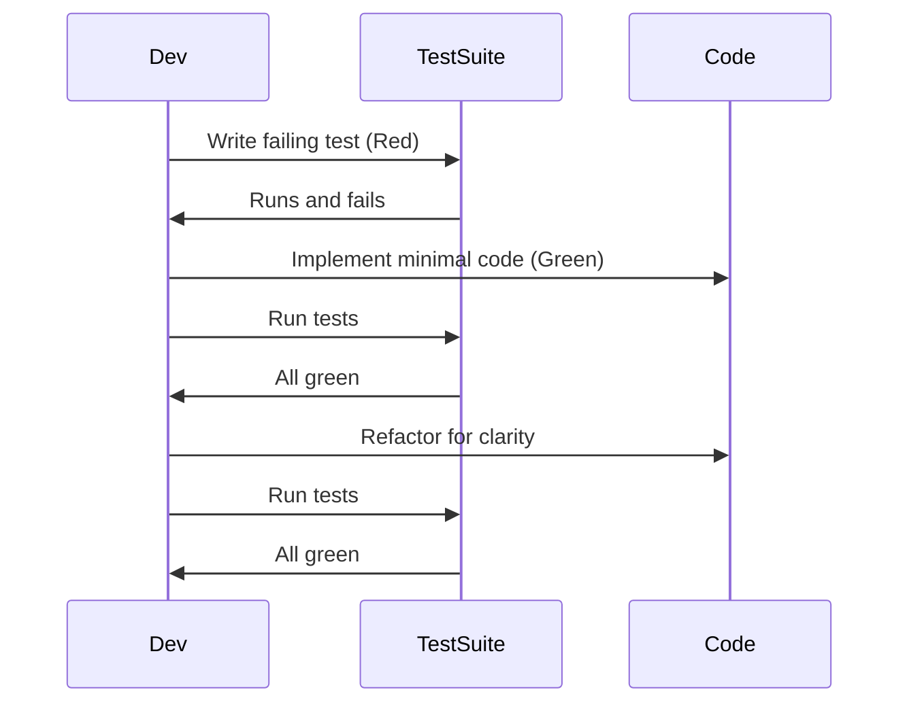

# ERD — what it is and how to produce one (practical, step-by-step)

An Entity-Relationship Diagram (ERD) models the domain: entities (tables/collections), attributes (columns/fields), and relationships (1:1, 1:N, N:M). Start with the data you actually need for the first shippable use case, then expand. Practical steps:

1. Identify business *entities* (User, Product, Order, Payment, AuditLog).
2. For each entity list attributes and pick a canonical primary key.
3. Define relationships and cardinality; prefer explicit join tables for N:M.
4. Add constraints: unique, required, default values, and typical indexes.
5. Mark ownership and cascade rules (who deletes what).
6. Iterate with real example queries: can you express the most common reads/writes? If not, refactor entities or add derived tables/indices.

If you want fast collaborative diagrams, use Eraser (AI-assisted diagram generation, docs, VS Code extension, GitHub sync). It’s built for quick, editable diagrams and supports diagram-as-code and AI prompts to generate ERDs. ([Eraser][1])

If your focus is database design (especially MongoDB/NoSQL) or you need forward/reverse engineering and script generation, Moon Modeler is specialized for schema modeling, reverse engineering from live DBs, script export and documentation generation. Use Moon Modeler when you need DB artifacts (validation rules, migration scripts) rather than purely visual docs. ([Datensen][2])

# Quick comparison — when to use which

Eraser — best when you need: collaborative design docs, rapid prototyping, AI-assisted diagram creation, team whiteboarding, embedding diagrams into design docs and product artifacts. Good for architecture and fast ERD sketches that will live in documentation. ([Eraser][3])

Moon Modeler — best when you need: production-grade DB modeling (MongoDB/NoSQL and relational via sister tools), reverse engineering from a live DB, script generation, exportable reports, or an offline desktop tool with licensing options. Choose it for formal DB lifecycle tasks (migrations, schema validation, DB-centric documentation). ([Datensen][4])

Recommendation: start diagrams and cross-team design in Eraser for speed and collaboration; when design stabilizes and you need DB artifacts, port to Moon Modeler (or keep Moon Modeler as the source of truth for DB-level schemas).

# Expectations, pitfalls, growth

Expectation: diagram tools speed communication and reduce misinterpretation. Pitfall: treating diagrams as documentation you never update — diagrams must be versioned with code or the docs become stale. Growth path: sketch in Eraser → finalize schema in Moon Modeler → generate migration scripts → include generated artifacts in repo (under `/db` or `/schema`) and CI tests to validate DB vs model.

# Coding approach, project structure, and reasoning

Principle: each module/function should have a single responsibility. Split responsibilities into small, testable functions (validateInput, fetchUser, mapResponse, sendResponse) rather than huge god functions. Benefits:

* Easier unit tests (small, deterministic functions).
* Safer refactor (you can replace one step without rewriting the rest).
* Clearer code review (smaller diff, easier to reason about).
* Better reuse and composition.

### Example high-level project structure (production level)

```
/repo-root
├─ .nvmrc
├─ package.json
├─ .eslintrc.cjs
├─ .prettierrc
├─ .prettierignore
├─ .gitignore
├─ docker/
│   ├─ docker-compose.dev.yaml
│   ├─ docker-compose.prod.yaml
│   └─ Dockerfile
├─ infra/
│   ├─ kubernetes/
│   └─ terraform/
├─ src/
│   ├─ config/           # typed config from env
│   ├─ controllers/      # HTTP handlers (thin)
│   ├─ services/         # business logic (stateless)
│   ├─ models/           # DB models / schemas / interfaces
│   ├─ dao/              # Data access objects (single DB concerns)
│   ├─ validators/       # input validators
│   ├─ routes/
│   ├─ middlewares/
│   ├─ workers/          # background jobs/consumers
│   ├─ queues/
│   ├─ utils/            # pure helper functions
│   ├─ emails/
│   ├─ tests/            # unit & integration tests
│   └─ app.ts
└─ docs/
    ├─ architecture/
    └─ onboarding.md
```

Rationale: controllers are thin request/response adapters; services contain core business logic and are easily testable; DAO abstracts persistence (so you can swap DB / mock in tests).

# SOLID and design disciplines (concise, actionable)

* Single Responsibility: one reason to change per module. Example: an `OrderService` should not send emails; it should emit events; a separate `NotificationService` handles delivery.
* Open/Closed: design modules so they’re open for extension (via interfaces) but closed for modification (don’t rewrite existing behavior to add features).
* Liskov Substitution: concrete implementations must behave like their abstractions.
* Interface Segregation: prefer small, specific interfaces over large monoliths.
* Dependency Inversion: depend on abstractions (interfaces), not concretions.

Practical rule: prefer composition over inheritance; write small pure functions; document invariants. Show DRY and SRP by example:
Bad:

```js
async function handleUser(req, res) {
  // validate, db, map, call external API, format response, send
}
```

Good:

```js
function validateInput(payload) { /* throw on invalid */ }
async function fetchUser(id) { /* DAO */ }
function mapResponse(user) { /* pure mapping */ }
function sendResponse(res, body) { res.json(body) }
```

# Naming & structure — rules of thumb

* Prefer clear, intention-revealing names over comments. Names > Comments. If you need a long comment, consider a better name.
* Use domain language: `OrderService.createOrder` not `Service1.doThing`.
* Functions: verb-noun (e.g., `calculateInvoice`, `sendVerificationEmail`).
* Types/Interfaces: noun (e.g., `Order`, `UserDTO`).
* Keep files small — one exported responsibility per file when it makes sense.

# DRY, KISS, YAGNI and maintenance

* DRY: Extract repeated logic into well-named functions; duplication increases bug surface area.
* KISS: prefer simple, well-tested logic over clever micro-optimizations.
* YAGNI: don’t add abstractions for features you may never build; add them when a second use case appears.

Maintainability checklist:

* Small PRs
* Tests for new behavior
* Clear change logs in docs/ or changelog
* Architectural decision records (ADR) for major decisions

# Linting, formatting, and editor settings

Why:

* Enforces style and catches classes of bugs statically.
* Makes code reviews focus on logic, not style.

Recommended tools and example configs:

* ESLint (static rules + TypeScript plugin if used).
* Prettier (formatting).
* lint-staged + Husky (run lint/test on pre-commit).
* TypeScript compiler for structural checks.

Example `.eslintrc.cjs` (JS/TS hybrid):

```js
module.exports = {
  root: true,
  env: { node: true, es2022: true, jest: true },
  extends: [
    "eslint:recommended",
    "plugin:@typescript-eslint/recommended",
    "prettier"
  ],
  parser: "@typescript-eslint/parser",
  plugins: ["@typescript-eslint"],
  rules: {
    "no-console": "warn",
    "complexity": ["error", 20],
    "@typescript-eslint/explicit-module-boundary-types": "off"
  }
};
```

`.prettierrc`:

```json
{
  "printWidth": 100,
  "singleQuote": true,
  "trailingComma": "all",
  "tabWidth": 2
}
```

`package.json` scripts:

```json
"scripts": {
  "lint": "eslint 'src/**/*.{js,ts}' --max-warnings=0",
  "format": "prettier --write 'src/**/*.{js,ts,json,md}'",
  "test": "jest --runInBand"
}
```

`lint-staged` and `husky` (package.json extract):

```json
"husky": {
  "hooks": {
    "pre-commit": "lint-staged"
  }
},
"lint-staged": {
  "src/**/*.{js,ts}": ["eslint --fix", "prettier --write", "git add"]
}
```

VSCode `settings.json` (explore and adapt):

```json
{
  "editor.formatOnSave": true,
  "editor.codeActionsOnSave": {
    "source.fixAll.eslint": true
  },
  "files.exclude": { "node_modules": true, "dist": true },
  "eslint.packageManager": "npm"
}
```

Enforce lint errors as build blockers in CI — not merely warnings.

# Logging and monitoring

Logging strategy:

* Log boundaries where external IO or errors occur (DB failures, API calls, auth failures). Do NOT log entire application flow at debug in production.
* Use structured JSON logs (timestamp, level, service, requestId, userId (if permitted)).
* Use correlation IDs (requestId) threaded through the stack and into logs.

Libraries:

* `morgan` for HTTP request logs (express middleware).
* `winston` or `pino` for application logging (structured, JSON).
  Log example:

```js
const logger = createLogger({ transports: [new Winston.transports.Console()] });
logger.error('Payment failed', { orderId, userId, error: err.message, requestId });
```

Monitoring signals:

* Logs (what happened).
* Metrics (counts, latencies, error rates).
* Traces (where time is spent).

# Git: save game and branch model

Rules:

* Commit early, commit often; small atomic commits with meaningful messages.
* Protect `main`/`master` (no direct pushes).
* Branch naming: `feature/<ticket-id>-short-summary`, `fix/<ticket>`, `chore/<area>`.
* Workflow: feature branch → PR → review → merge to `main` after CI green.

Conflict handling:

* Prefer rebase for local tidy history before merging; use merge commits for long-running integration branches if you want a visible merge record. Strategy matters less than consistency and CI green merges.

# Pull request etiquette and review checklist

PR body should have:

* Short summary (1-2 lines) and motivation.
* What changed, key files, and screenshots for UI.
* Tests added / how to run manually.
* Reviewers and related tickets.

Review checklist:

* Does it build locally?
* Are tests added and passing?
* No console.log left?
* Is there backward compatibility for APIs?
* Edge cases and error handling considered?
* Proper logging and metrics added for new code paths?
* Proper linting and formatting?

# Testing & QA (comprehensive)

Testing types:

* Unit tests: test single functions in isolation. Use Jest or your preferred framework. Example unit test (Jest):

```ts
// sum.test.ts
import { sum } from './math';
test('adds numbers', () => expect(sum(1,2)).toBe(3));
```

* Integration tests: test modules wired together (e.g., service + DAO against an in-memory DB or test container). Use test DB instances (docker compose) and tear down between runs.
* End-to-end (E2E): exercise full user flows in a browser (Playwright, Cypress). Use dedicated staging with consistent test data.

TDD:

* Red → Write a failing test.
* Green → Implement minimal code to pass.
* Refactor → Improve design and keep tests green.

Mermaid diagram for TDD:



# CI/CD pipeline (example GitHub Actions)

High level:

1. On push: run lint, unit tests, build artifact.
2. On merge to `staging`: deploy to staging automatically.
3. On staging success: manual approval step to deploy to `prod`.

Example minimal workflow:

```yaml
name: CI
on: [push, pull_request]
jobs:
  test:
    runs-on: ubuntu-latest
    steps:
      - uses: actions/checkout@v4
      - uses: actions/setup-node@v4
        with: node-version: 18
      - run: npm ci
      - run: npm run lint
      - run: npm test
  build:
    needs: test
    runs-on: ubuntu-latest
    steps:
      - run: npm run build
```

Add CD jobs to deploy artifacts to your cloud provider; include staging → manual approval → prod with appropriate secrets and rollbacks.

# Monitoring, SLOs, and observability

* Define SLOs (e.g., 99.9% successful requests per minute).
* Track SLA components: availability, error rates, latency percentiles (p50/p95/p99).
* Use tracing (OpenTelemetry) to link logs, metrics and traces.
* Instrument critical paths: auth, payments, core reads/writes.
* Expose health checks and readiness checks for orchestration.

# Scaling strategies

* Vertical scaling: increase machine size; quick but limited.
* Horizontal scaling: more instances behind a load balancer; requires stateless services or session store (Redis).
* Caching: Redis for application caches, CDN for static assets.
* Rate limiting and graceful degradation: protect backends under heavy load; return degraded but useful responses.
* Autoscaling: configure scaling thresholds for CPU / RPS / latency and include min/max capacity and warmup rules (pre-scale before expected traffic spikes).
* Keep memory usage with buffer (target < 60–70% under usual load) to allow GC and headroom; instrument memory usage.

# Deployment tips and operational hygiene

* Use health checks / liveness probes.
* Canary or blue/green deploy for safer rollouts.
* Keep deployments atomic and idempotent.
* Always have runbooks and on-call escalation.
* Backups and migration rollback plans for DB changes.

# Over-engineering vs Under-engineering

* Over-engineering: building features or abstractions you cannot justify with real users — avoid premature optimization and complex distributed systems unless required.
* Under-engineering: shipping with no tests, no monitoring, and brittle infra — high risk and technical debt.

# Documentation & onboarding

* README with quickstart (5 minutes to run locally), architecture diagram, and how to run tests.
* API contracts (OpenAPI / AsyncAPI).
* ADRs for decisions (why DB choice, why message bus, etc).
* Contributing.md and CODE_OF_CONDUCT for open teams.

# Example production-level file list (expanded)

```
/docs
/infra
/docker
/.github
/src
  /assets
  /config
  /controllers
  /services
  /dao
  /models
  /validators
  /routes
  /middlewares
  /workers
  /queues
  /tests
  /utils
/logs
/scripts
/.prettierrc
/.prettierignore
/.eslintrc.cjs
/.nvmrc
/Dockerfile
/docker-compose.dev.yaml
/docker-compose.prod.yaml
/.github/workflows/ci.yml
```

# Example: quick sample of logging + validation + controller

```ts
// validators/userValidator.ts
export function validateCreateUser(payload) {
  if (!payload.email) throw new ValidationError('email required');
}

// controllers/userController.ts
export async function createUser(req, res) {
  const requestId = req.headers['x-request-id'] || uuid();
  try {
    validateCreateUser(req.body);
    const user = await userService.create(req.body);
    logger.info('user.created', { userId: user.id, requestId });
    res.status(201).json(user);
  } catch (err) {
    logger.error('user.create.failed', { error: err.message, requestId });
    res.status(400).json({ error: err.message });
  }
}
```

# Final recommendation on ERD tooling selection

* Use Eraser for collaborative, iterative design and documentation; it accelerates diagram creation with AI and integrates with docs and VS Code for team workflows. Use it during early design, design reviews and cross-functional communication. ([Eraser][1])
* Use Moon Modeler when you require DB-centric modeling, reverse engineering, script generation and formal artifacts for migrations and documentation — especially for MongoDB/NoSQL projects. Keep Moon Modeler artifacts in your repo under `/db` for CI checks. ([Datensen][4])

If you want, I can:

* produce a concrete ERD for a specific domain (send entity list and a few queries), and export it as a JSON/mermaid/SQL schema ready for Moon Modeler or Eraser; or
* generate the exact ESLint/Prettier/Husky config files and a sample GitHub Actions CI file tailored to your stack (Node/TS, Python, etc.).

Which of those two would you like me to do next?

[1]: https://www.eraser.io/?utm_source=chatgpt.com "Eraser – AI co-pilot for technical design"
[2]: https://www.datensen.com/moon-modeler-for-databases.html?utm_source=chatgpt.com "Moon Modeler: A Data Modeling Tool for MongoDB & NoSQL"
[3]: https://www.eraser.io/product/ai-diagrams?utm_source=chatgpt.com "Generate AI-powered diagrams in seconds"
[4]: https://www.datensen.com/blog/docs/compare-editions/?utm_source=chatgpt.com "Compare editions - Moon Modeler"
